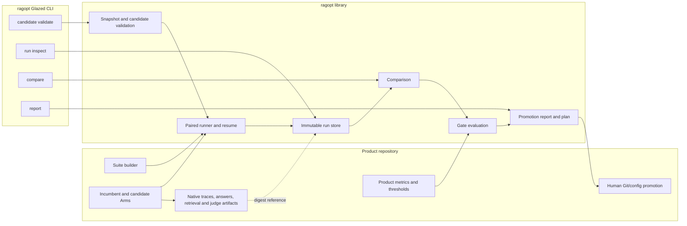
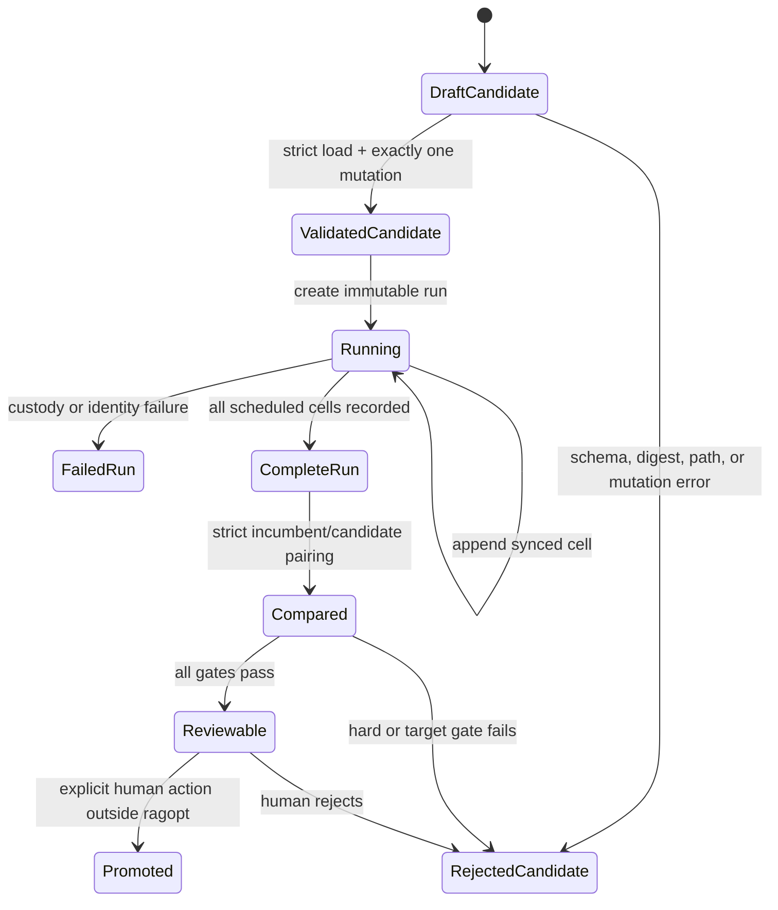

# Ragopt: Intern Guide to a Reusable Evidence-Gated Optimization Harness

## 1. Executive summary

`ragopt` should be a small Go library and Glazed command-line tool for running
**evidence-gated optimization experiments**. Its job is not to retrieve
documents, call an LLM, judge answers, analyze every transcript, invent prompt
changes, or deploy production configuration. Those responsibilities already
belong to product systems. Its job is to make the experimental spine difficult
to skip:

1. identify the incumbent system semantically;
2. represent one proposed mutation as an immutable candidate;
3. copy or digest every input that must remain fixed;
4. run incumbent and candidate on the same cases and repeat numbers;
5. sync every completed result so interruption is recoverable;
6. compare outcomes pairwise without dropping failures;
7. apply a versioned, product-chosen gate policy;
8. produce a promotion report and plan for human review.

This design is deliberately narrower than the earlier GEPA-inspired proposal.
The earlier proposal correctly described feedback/validation/audit separation,
one-component mutation, paired reports, and human promotion. However, its
diary says the ticket was documentation and design only, and every
implementation task remained unchecked. Calling that design a working
self-optimizer created the wrong mental model. `ragopt` starts by packaging the
parts that were actually implemented and exercised elsewhere:

- RAG-TTC's immutable run directories, copied inputs, atomic JSON, synced
  JSONL, and terminal state;
- RAG-TTC's small `Arm`/`Outcome` comparison boundary and native artifact
  ownership;
- RAG-TTC's strict cross-artifact validation and deterministic diagnostic
  packets;
- RAG-TTC's strict file-backed configuration, resolved semantic digests, and
  compiled safety ceilings;
- researchctl's canonical plan identity, explicit replicate coordinates,
  resumable terminal work, and refusal to guess about active-run recovery;
- GEC-RAG's practical candidate gates, per-stratum reporting, durable expensive
  caches, and honest negative experiment record.

The result is a reusable package, but not a general workflow engine. A product
command imports `ragopt` and supplies real in-process arms. The standalone
`ragopt` binary validates candidates, inspects runs, compares completed
artifacts, and renders reports. V1 does not invent a subprocess protocol or Go
plugin system to execute arbitrary applications.

The first release is successful when one human-authored RAG-TTC candidate and
one human-authored GEC-RAG candidate each traverse the complete path twice with
the same locked identities and explainable paired results. A reflector can be
considered later as another candidate proposer. It is not the foundation.

## 2. Problem statement

### 2.1 The recurring failure mode

The recent GEC-RAG optimization work added useful retrieval candidates and a
working measurement command. Yet the deep review found that the control plane
was still a set of imperative CLI branches. A sweep could print a gate decision
without creating an immutable object that answered:

- Which exact corpus, index, prompt, tool description, model, judge, evaluation
  set, and gate policy were used?
- Which one asset differed between incumbent and challenger?
- Did both systems evaluate the same question and repeat?
- Were timeouts and judge failures counted or dropped?
- Can the result be resumed and reproduced after interruption?
- Why did the candidate pass or fail, per example and per group?
- What exact production file would a human promote?

Without those answers, a command can execute candidates but it is not yet a
self-optimization framework. More autonomy would magnify the ambiguity.

### 2.2 Why a separate repository makes sense

Putting this harness in `ragkit` would mix two different kinds of reuse.
`ragkit` owns RAG capabilities: representations, indexes, retrieval, ranking,
and related domain behavior. The experiment spine is useful even when an arm
is not implemented with Ragkit and even when the mutable asset is a prompt,
tool description, SQL view, or routing policy. A separate repository gives the
harness its own schema versioning, CLI, release cadence, and dependency
direction:

```text
product runtime -> may depend on ragkit
product experiment command -> depends on ragopt
ragopt -> does not depend on product runtime or ragkit
```

This does not mean `ragopt` should become universal experiment infrastructure.
Researchctl already explores that larger space with plans, laboratories,
attempts, observation sinks, process runners, SQLite, retries, and concurrency.
`ragopt` specializes in the incumbent/candidate comparison and promotion
contract required by RAG and chatbot optimization.

### 2.3 What “self-optimization” means here

For this project, optimization is a closed evidence loop:

```text
diagnose -> propose -> evaluate -> compare -> gate -> review -> promote/reject
```

Only the middle four operations must be implemented by `ragopt` v1. Diagnosis
and proposal may be human or product-specific. Promotion is always a human Git
or configuration action. “Self” means that the system's recorded trajectories
and evaluation results can drive the next candidate; it does not mean the
running service rewrites itself.

## 3. Scope, non-goals, and terminology

### 3.1 V1 responsibilities

`ragopt` owns:

- content identity for inputs, assets, snapshots, candidates, suites, policies,
  runs, and result cells;
- immutable candidate bundles with exactly one changed mutable asset;
- immutable run directories and copied inputs;
- a small in-process evaluation interface;
- append-and-sync result custody and exact resume coordinates;
- paired comparison by case and repeat;
- generic hard-gate mechanics over product-defined metrics;
- Markdown and machine-readable promotion reports;
- artifact-focused Glazed commands.

### 3.2 Explicit non-goals

V1 does not provide:

- retrieval, indexing, chunking, reranking, answer generation, or a chat loop;
- an LLM judge or universal RAG quality score;
- a transcript warehouse or arbitrary SQL analysis surface;
- a reflector, prompt writer, mutation search algorithm, or GEPA population;
- a scheduler, distributed queue, daemon, web UI, or experiment database;
- a generic subprocess, RPC, dynamic plugin, or backward-compatibility adapter;
- automatic production writes, deployment, rollback, or online learning;
- simultaneous mutation of multiple assets;
- mutation of authorization, safety ceilings, suite labels, evaluator, judge, or
  gate policy inside an answer-system experiment.

These are not omissions to hide. They are the boundaries that keep the first
implementation small and attributable.

### 3.3 Terms

- **Asset:** one byte sequence with a logical name, media type, path, digest,
  and size.
- **Locked asset:** an asset that must not change in this experiment, such as a
  judge prompt, evaluation set, or safety policy.
- **Mutable asset:** an asset eligible for isolated candidate mutation, such as
  a tool description or orchestration prompt.
- **Snapshot:** the complete semantic identity of one system configuration:
  locked assets, mutable assets, and scalar dimensions such as model identity.
- **Candidate:** a proposed child snapshot plus hypothesis and provenance,
  validated to change exactly one mutable asset.
- **Suite:** the stable ordered set of evaluation cases and groups.
- **Arm:** an in-process implementation that evaluates one case under one
  snapshot/candidate and returns a small common outcome.
- **Native artifact:** the product-owned complete execution evidence for one
  cell. `ragopt` points to it; it does not replace it.
- **Cell:** one `(case ID, repeat index, arm name, candidate ID)` result.
- **Paired delta:** candidate minus incumbent for the same case and repeat.
- **Gate policy:** versioned rules that separate hard invariants, target
  improvement, regression tolerances, and tie-breakers.
- **Promotion report:** human-readable evidence. It is not authorization to
  deploy.

## 4. Evidence audit: what exists and what does not

### 4.1 Evidence classification

The design uses four evidence labels:

| Label | Meaning |
|---|---|
| Implemented and exercised | Source and tests exist; the mechanism was used in real experiment work. |
| Implemented, product-specific | Source exists and worked, but the types or semantics belong to one product. |
| Designed only | A guide or task exists without implementation evidence. |
| Deferred | The prior work explicitly postponed it pending stronger evidence. |

### 4.2 Mechanism matrix

| Mechanism | Evidence | Classification | `ragopt` response |
|---|---|---|---|
| Immutable run directory | `rag-ttc/pkg/experiment/run.go` | Implemented and exercised | Port narrowly into `pkg/runstore`. |
| Copied inputs and SHA-256 | `rag-ttc/pkg/experiment/input.go` | Implemented and exercised | Preserve role/path/digest/size contract. |
| Atomic JSON and synced JSONL | `run.go`, `write.go` | Implemented and exercised | Preserve exact durability semantics. |
| Terminal complete/fail state | `pkg/experiment/terminal.go` | Implemented and exercised | Preserve terminal write rejection. |
| Small native-arm projection | `pkg/rag/tooleval/runner.go` | Implemented and exercised | Generalize types without a product adapter layer. |
| Deterministic failure packet | `pkg/rag/diagnostic/*` | Implemented, product-specific | Product keeps diagnosis; `ragopt` records case references. |
| Strict semantic config digest | `pkg/rag/toolconfig/load.go` | Implemented and exercised | Apply same pattern to snapshots/candidates/policies. |
| Compiled safety ceilings | `pkg/rag/toolconfig/types.go` | Implemented and exercised | Candidate schemas cannot contain locked safety policy. |
| Replicate-aware plan identity | `researchctl/pkg/experimentplan/types.go` | Implemented and exercised | Use explicit repeat index in cell key. |
| Resume terminal work | `researchctl/pkg/experimentservice/service.go` | Implemented and exercised | Resume completed cells by full identity. |
| Active-run recovery refusal | `experimentservice/service.go:105-107` | Implemented and exercised | Never infer that an active/partial run is safe to overwrite. |
| One-component candidate bundle | RAG-TTC GEPA guide | Designed only | Implement after run store, prove with human candidate. |
| Paired repeated promotion gate | RAG-TTC GEPA guide and GEC review | Designed only in reusable form | Implement in phases 3–4. |
| Transcript SQLite warehouse | RAG-TTC GEPA guide | Designed only | Exclude from v1. |
| Reflector | RAG-TTC GEPA guide | Designed only | Defer until manual proof cycle. |
| GEPA/Pareto search | Earlier research | Deferred | Exclude from v1. |
| Automatic deployment | Explicitly rejected | Deferred/non-goal | Produce plan only; never apply. |

### 4.3 Lessons from RAG-TTC

The strongest reusable insight is separation of common evaluation from native
execution. `tooleval.Outcome` is intentionally small and contains an
`ArtifactPath`; each arm keeps its complete evidence in its native format. This
prevents a common abstraction failure: defining a universal transcript so
large that every product must distort its runtime to fit it.

The second insight is that artifact consistency is executable behavior.
`diagnostic.ValidateSources` rejects question-count mismatches, unknown IDs,
question text drift, duplicate outcomes, judge/arm mismatches, invalid status
combinations, and native answer/citation drift. `ragopt` should apply this
strictness to pairing. Missing cells are not ignored data; they invalidate or
fail a comparison according to policy.

The third insight is that safety policy and experimental text require separate
ownership. `toolconfig` resolves file-backed prompts/descriptions into a
semantic digest but keeps maximum calls, rows, result depth, payload sizes, and
allowed views compiled. A candidate may replace a tool description but cannot
remove the safety suffix or increase ceilings.

### 4.4 Lessons from researchctl

Researchctl demonstrates more infrastructure than `ragopt` should copy. Its
`Runner` emits events, artifacts, metrics, traces, and attempt completion into
an authoritative laboratory. Its experiment service expands plans, runs
bounded workers, resumes terminal replicas, joins execution errors, and
handles explicit active-run recovery.

The useful subset is:

- canonicalize before scheduling;
- persist the canonical plan by digest;
- include replicate index in identity;
- distinguish pending, active, and terminal work;
- refuse to guess about active recovery;
- keep failures in the result set;
- attach plan provenance to every execution.

The deliberately excluded subset is the laboratory database, process runner,
observation sink, generalized domain registry, retry attempts, and concurrent
scheduler. `ragopt` can add bounded concurrency only after sequential product
runs show that execution time, rather than provider rate limits, is the actual
bottleneck.

### 4.5 Lessons from GEC-RAG

GEC-RAG shows why the harness is needed. It achieved real improvements in
evaluation breadth, caching, reranker comparisons, and judge decomposition,
but the deep review found:

- no immutable evaluation run;
- incomplete semantic runtime identity;
- no first-class candidate object;
- the same small dataset used for authoring, tuning, and verdicts;
- unpaired, unrepeated answer-quality comparison;
- dropped judge failures and unsafe zero-statement success;
- gate-policy drift between design and code;
- a tool description embedded in Go and therefore not safely diffable;
- authorization after candidate text crossed the trusted boundary.

`ragopt` cannot repair product security or judge semantics. It can make their
identities and outcomes explicit, prevent missing failures from improving a
candidate, and refuse comparison when locked inputs drift. GEC-RAG must fix its
P0 issues before its promotion results are trustworthy.

## 5. Target architecture

### 5.1 Component view



The key direction is that product code calls `ragopt`. `ragopt` never imports a
product. Native artifacts stay with the product, while the run contains their
paths and digests.

### 5.2 Package layout

Create packages only when their phase begins:

```text
pkg/runstore/    immutable run lifecycle and readers
pkg/candidate/   assets, snapshots, candidate manifests, strict validation
pkg/eval/        suites, Arm, Outcome, Cell, sequential paired runner, resume
pkg/compare/     strict pairing and aggregate deltas
pkg/gate/        versioned policy, decisions, promotion report model
cmd/ragopt/      Glazed artifact commands
```

Do not create `pkg/optimizer`, `pkg/workflow`, `pkg/plugin`, or
`pkg/transcriptwarehouse` in anticipation of future work. Package names should
state the mechanism they implement.

### 5.3 Ownership table

| Concern | Owner |
|---|---|
| Retrieval, tool loop, LLM calls | Product |
| Judge execution and judge prompt | Product |
| Diagnostic/failure taxonomy | Product |
| Suite cases and group labels | Product |
| Metric definitions and thresholds | Product |
| Snapshot/candidate schema mechanics | `ragopt` |
| Run artifact lifecycle | `ragopt` |
| Cell key, resume, strict pairing | `ragopt` |
| Generic numeric deltas and gate ordering | `ragopt` |
| Native execution artifacts | Product |
| Promotion evidence | `ragopt` |
| Promotion authorization/application | Human/product Git workflow |

## 6. End-to-end lifecycle

### 6.1 State flow



Candidate status and run status are distinct. A failed run does not mutate the
candidate into a different asset. A candidate may have several run IDs, each
with a frozen suite and policy identity.

### 6.2 Operator flow

1. Product code creates an incumbent snapshot.
2. A human creates a candidate bundle with one complete replacement asset.
3. `ragopt candidate validate` verifies paths, bytes, digests, parent identity,
   and exactly one mutable difference.
4. Product code constructs the same ordered suite and two arms.
5. `eval.Run` creates a run, copies all inputs, and executes cells.
6. Every cell is appended and synced before the next cell begins.
7. If interrupted, the same invocation validates the run identity and skips
   only completed keys.
8. `compare` requires every expected pair or emits an incomplete comparison.
9. `gate` applies hard invariants, target improvement, regression limits, then
   tie-breakers.
10. `report` renders identities, asset diff, every regression, and decision.
11. A human promotes or rejects through the product's normal Git/config flow.

## 7. Artifact and schema contracts

The following schemas are proposed APIs, not implemented behavior. Use strict
YAML or JSON decoding and reject unknown fields. Every `api_version` begins at
v1; do not add compatibility adapters before a released schema requires them.

### 7.1 Asset reference

```go
type AssetRef struct {
    Name      string `json:"name" yaml:"name"`
    MediaType string `json:"media_type" yaml:"media_type"`
    Path      string `json:"path" yaml:"path"`
    SHA256    string `json:"sha256" yaml:"sha256"`
    SizeBytes int64  `json:"size_bytes" yaml:"size_bytes"`
}
```

Rules:

- `Name` is a stable logical identifier such as `search_description`.
- `Path` is relative to the bundle root and resolves to a regular file inside
  that root after symlink resolution.
- the digest uses one canonical textual form, recommended
  `sha256:<lowercase hex>`;
- no digest is trusted until bytes are read and recomputed;
- duplicate logical names are invalid;
- asset order does not affect identity; canonical encoding sorts by name.

### 7.2 System snapshot

```yaml
api_version: ragopt-snapshot/v1
system: rag-ttc-tool-qa
snapshot_id: sha256:...

locked_assets:
  - name: evaluation_suite
    media_type: application/yaml
    path: locked/evaluation.yaml
    sha256: sha256:...
    size_bytes: 18432
  - name: judge_prompt
    media_type: text/markdown
    path: locked/judge.md
    sha256: sha256:...
    size_bytes: 4380

mutable_assets:
  - name: orchestration_prompt
    media_type: text/markdown
    path: mutable/orchestration.md
    sha256: sha256:...
    size_bytes: 2810
  - name: search_description
    media_type: application/yaml
    path: mutable/search-description.yaml
    sha256: sha256:...
    size_bytes: 1420

dimensions:
  answer_model: openai-codex:gpt-5.6-luna-low
  judge_model: openai:gpt-5.6-luna
  corpus_digest: sha256:...
  index_digest: sha256:...
  evaluator: rag-ttc-answer-quality/v3
  tool_safety: rag-ttc-tool-safety/v1
```

`dimensions` is the escape hatch for product-specific scalar identity, but it
is not unvalidated free-form data. Keys must match a conservative identifier
pattern, values must be bounded nonempty strings, keys must be unique, and the
product integration must declare required keys before execution. The canonical
snapshot digest includes the API version, system, sorted asset records, and
sorted dimensions.

### 7.3 Candidate bundle

```text
candidate-search-description-002/
├── candidate.yaml
├── parent/
│   └── snapshot.yaml
├── candidate/
│   ├── snapshot.yaml
│   └── assets/
│       └── search-description.yaml
└── provenance/
    └── selected-cases.json
```

```yaml
api_version: ragopt-candidate/v1
candidate_id: candidate-search-description-002
parent_snapshot: parent/snapshot.yaml
candidate_snapshot: candidate/snapshot.yaml

proposer:
  kind: human
  identity: manuel

mutation:
  asset: search_description
  hypothesis: >-
    Comparison failures occur because the tool description does not require
    evidence acquisition for each named subject.
  expected_improvement:
    metric: comparison_completeness
    groups: [comparison]
  regression_risks:
    - additional searches on single-subject questions
    - higher provider and tool-call cost

evidence:
  diagnostic_manifest_digest: sha256:...
  selected_case_ids: [cmp-03, cmp-08, cmp-14]
```

The bundle contains complete bytes for the changed asset. It does not contain
a patch to apply. Validation computes the parent/candidate difference itself
and requires:

- same system name;
- identical locked assets and dimensions;
- identical set of mutable asset names;
- exactly one mutable asset with different bytes/digest;
- `mutation.asset` equals that changed name;
- all referenced files confined to the bundle;
- every digest and size matches;
- a nonempty hypothesis, expected metric, and regression risk list.

`proposer.kind` may eventually be `model`, but v1 implementation and proof use
`human`. No behavior changes based on proposer kind.

### 7.4 Evaluation suite

```go
type Suite struct {
    APIVersion string `json:"api_version"`
    Name       string `json:"name"`
    Cases      []Case `json:"cases"`
}

type Case struct {
    ID     string          `json:"id"`
    Groups []string        `json:"groups,omitempty"`
    Input  json.RawMessage `json:"input"`
}
```

Suite rules:

- IDs are unique and nonempty;
- input is a valid JSON value and opaque to `ragopt`;
- groups are unique, sorted in canonical form, and product-defined;
- declared case order is preserved for execution and stored in the digest;
- canonical JSON defines the suite digest;
- the suite is copied into the run inputs;
- feedback, validation, and audit are separate suite artifacts, not a mutable
  flag on one case during the run.

### 7.5 Outcome and cell

```go
type Outcome struct {
    Completed      bool               `json:"completed"`
    ContractValid  bool               `json:"contract_valid"`
    Abstained      bool               `json:"abstained"`
    Failure        *Failure           `json:"failure,omitempty"`
    Metrics        map[string]float64 `json:"metrics,omitempty"`
    ProviderCalls  int                `json:"provider_calls,omitempty"`
    ToolCalls      int                `json:"tool_calls,omitempty"`
    InputTokens    int                `json:"input_tokens,omitempty"`
    OutputTokens   int                `json:"output_tokens,omitempty"`
    Duration       time.Duration      `json:"duration"`
    NativeArtifact ArtifactRef        `json:"native_artifact"`
}

type Failure struct {
    Class   string `json:"class"`
    Message string `json:"message"`
}

type Cell struct {
    APIVersion      string    `json:"api_version"`
    RunID           string    `json:"run_id"`
    CaseID          string    `json:"case_id"`
    RepeatIndex     int       `json:"repeat_index"`
    Arm             string    `json:"arm"`
    CandidateID     string    `json:"candidate_id"`
    SnapshotDigest  string    `json:"snapshot_digest"`
    SuiteDigest     string    `json:"suite_digest"`
    PolicyDigest    string    `json:"policy_digest"`
    StartedAt       time.Time `json:"started_at"`
    FinishedAt      time.Time `json:"finished_at"`
    Outcome         Outcome   `json:"outcome"`
}
```

The cell key is:

```text
(suite digest, policy digest, candidate ID, snapshot digest,
 case ID, repeat index, arm name)
```

A case error becomes a completed failed cell whenever a valid native failure
artifact can be recorded. Custody errors—wrong identity, path escape, corrupt
run manifest, duplicate conflicting cell—stop the run because subsequent data
would not be trustworthy.

Metric rules:

- names are bounded identifiers;
- values must be finite; reject NaN and infinity;
- missing metric is different from zero;
- a failed/incomplete outcome is never silently excluded from denominator
  accounting;
- product code, not `ragopt`, defines metric semantics.

### 7.6 Gate policy

```yaml
api_version: ragopt-gate-policy/v1
name: rag-ttc-search-description-promotion-v1

hard_gates:
  require_all_cells: true
  require_completed: true
  require_contract_valid: true
  max_failure_rate: 0
  metric_floors:
    faithfulness: 0.90

target:
  metric: comparison_completeness
  groups: [comparison]
  minimum_mean_delta: 0.05
  require_positive_each_repeat: true

regressions:
  maximum_case_delta:
    faithfulness: -0.20
    relevance: -0.20
  maximum_mean_delta:
    all:
      faithfulness: -0.01
      relevance: -0.01

tie_breakers:
  - provider_calls
  - tool_calls
  - total_tokens
  - duration
```

This schema supplies mechanics, not defaults. `ragopt` should ship no
universal `faithfulness >= 0.9` policy. The example belongs to the product.
Policies are copied and digested as locked run inputs. Editing the policy after
seeing candidate results creates a different run identity.

### 7.7 Run directory

```text
runs/20260806T151500.123456789Z-search-description-a1b2c3d4e5f6/
├── manifest.json
├── status.json
├── config.json
├── inputs/
│   ├── manifest.json
│   ├── suite.json
│   ├── gate-policy.yaml
│   ├── incumbent-snapshot.yaml
│   └── candidate-bundle.tar-or-directory-reference.json
├── results/
│   ├── cells.jsonl
│   ├── comparison.json
│   ├── paired-deltas.jsonl
│   ├── gate-decision.json
│   ├── promotion-plan.json
│   ├── promotion-report.md
│   └── summary.json
└── native/
    ├── incumbent/...
    └── candidate/...
```

The native tree may contain copied artifacts or product-created files inside
the run. If a product keeps large artifacts elsewhere, the cell must include a
content digest and stable path/URI; the run should state that custody mode.
V1 should prefer in-run artifacts for the proof fixture and integrations.

## 8. Go API design

### 8.1 Run store

The first package is a narrow port of RAG-TTC's proven implementation:

```go
type CreateOptions struct {
    Root        string
    Name        string
    Description string
    Dimensions  map[string]string
}

func Create(ctx context.Context, options CreateOptions, config any) (*Run, error)
func Open(ctx context.Context, directory string) (*Reader, error)

func (r *Run) CopyInput(ctx context.Context, role, source string) (InputRef, error)
func (r *Run) WriteJSON(ctx context.Context, relative string, value any) error
func (r *Run) WriteBytes(ctx context.Context, relative string, data []byte) error
func (r *Run) AppendJSONL(ctx context.Context, relative string, value any) error
func (r *Run) Complete(ctx context.Context, summary Summary) error
func (r *Run) Fail(ctx context.Context, cause error) error
```

Do not introduce a storage interface in Phase 1. Only the local filesystem has
been proved. An interface would imply support for object stores or databases
without evidence.

### 8.2 Candidate API

```go
func LoadSnapshot(ctx context.Context, root, manifestPath string) (*Snapshot, error)
func LoadCandidate(ctx context.Context, root, manifestPath string) (*Candidate, error)
func ValidateCandidate(ctx context.Context, candidate Candidate) (Mutation, error)

type Mutation struct {
    AssetName    string
    Parent       AssetRef
    Candidate    AssetRef
    ParentDigest string
    ChildDigest  string
}
```

Loading and validation may be one public operation if no caller needs a
partially loaded invalid candidate. Prefer the smaller API during
implementation.

### 8.3 Evaluation API

```go
type Arm interface {
    Name() string
    Run(ctx context.Context, request Request) (Outcome, error)
}

type Request struct {
    RunDirectory string
    Case         Case
    RepeatIndex  int
    Candidate    CandidateView
}

type CandidateView struct {
    CandidateID   string
    SnapshotDigest string
    Assets         map[string]ResolvedAsset
    Dimensions     map[string]string
}

type RunRequest struct {
    RunRoot     string
    Suite       Suite
    Policy      gate.Policy
    Incumbent   candidate.CandidateView
    Challenger  candidate.CandidateView
    Arms        []Arm
    Repeats     int
}

func Run(ctx context.Context, request RunRequest) (*RunResult, error)
func Resume(ctx context.Context, runDirectory string, request RunRequest) (*RunResult, error)
```

There are two reasonable arm shapes:

1. one arm object per incumbent/candidate;
2. one product evaluator receiving a candidate view.

V1 should choose the second internally if it avoids duplicate product setup,
but the public API must still make arm/candidate identity explicit. Do not add
both forms as compatibility APIs. Decide once during Phase 3 based on the first
RAG-TTC integration spike.

All concrete implementations assert interfaces:

```go
var _ eval.Arm = (*ToolQAArm)(nil)
```

### 8.4 Comparison API

```go
type PairKey struct {
    CaseID      string
    RepeatIndex int
}

type MetricDelta struct {
    Metric    string
    Incumbent float64
    Candidate float64
    Delta     float64
}

type Pair struct {
    Key       PairKey
    Groups    []string
    Incumbent Cell
    Candidate Cell
    Deltas    []MetricDelta
}

func Build(ctx context.Context, input Input) (*Report, error)
```

`Build` rejects duplicates and identity mismatch before computing any
aggregate. It reports missing pairs explicitly; a promotion gate with
`require_all_cells` then fails.

### 8.5 Gate API

```go
type DecisionStatus string

const (
    DecisionPass DecisionStatus = "pass"
    DecisionFail DecisionStatus = "fail"
)

type Decision struct {
    APIVersion string
    Status     DecisionStatus
    Checks     []CheckResult
    Reasons    []string
}

func Evaluate(ctx context.Context, policy Policy, report compare.Report) (Decision, error)
```

Gate evaluation is pure: no network, no file writes, no model calls, and no
environment lookup. It receives fully loaded values and returns a decision.

## 9. Core algorithms

### 9.1 Candidate validation

```text
function ValidateCandidate(bundleRoot, candidateManifest):
    manifest = strict_decode(candidateManifest)
    require manifest.api_version == ragopt-candidate/v1

    parent = strict_load_snapshot(bundleRoot, manifest.parent_snapshot)
    child  = strict_load_snapshot(bundleRoot, manifest.candidate_snapshot)

    verify_all_asset_paths_inside(bundleRoot)
    verify_all_asset_bytes_sizes_and_digests(parent, child)
    verify parent.system == child.system
    verify parent.dimensions == child.dimensions
    verify parent.locked_assets == child.locked_assets
    verify names(parent.mutable_assets) == names(child.mutable_assets)

    changed = byte_differences(parent.mutable_assets, child.mutable_assets)
    require len(changed) == 1
    require changed[0].name == manifest.mutation.asset
    require hypothesis_and_risks_present(manifest)

    recompute parent.snapshot_id and child.snapshot_id
    recompute candidate_id/digest from canonical manifest and assets
    return resolved immutable candidate
```

Compare bytes as well as declared digests. A malicious or accidental manifest
could reuse a parent digest while changing bytes.

### 9.2 Scheduling and resume

V1 order is deterministic:

```text
for case in suite.cases in declared order:
    for repeat in 1..repeats:
        run incumbent cell
        run candidate cell
```

Interleaving incumbent and candidate per case reduces temporal drift compared
with running every incumbent first and every candidate later. If a product has
provider rate limits or model drift concerns, it may choose randomized arm
order only in a later schema with a recorded seed. V1 uses declared order.

```text
function ExecuteOrResume(request, optionalRunDir):
    identities = canonicalize_and_digest(request suite, policy, snapshots)

    if new:
        run = runstore.Create(identities)
        copy all locked inputs
        completed = empty map
    else:
        run = open active run explicitly
        require stored identities == requested identities
        completed = read_cells_jsonl_strictly()
        reject duplicate key with different bytes
        tolerate one truncated final line only if run status is active

    for expectedKey in deterministic_schedule:
        if completed contains expectedKey:
            continue

        outcome, nativeArtifact = product_arm.Run(expectedKey)
        verify native artifact exists and digest it
        cell = normalize outcome + full expected identity
        append_jsonl_and_fsync(cell)

    verify all expected keys present
    write summary
    mark run complete
```

The truncated-tail rule must be explicit. RAG-TTC writes each line and calls
`fsync`, so a truncated line should be rare. A reader may report the tail as a
recoverable active-run condition, but it must not skip a malformed middle line.

### 9.3 Strict pairing

```text
function Pair(cells, schedule):
    index cells by full cell key
    reject duplicate conflicting keys

    for case/repeat in schedule:
        incumbent = lookup expected incumbent key
        candidate = lookup expected candidate key

        if either is absent:
            record MissingPair; do not synthesize score zero
            continue

        require locked identities match
        compute finite metric deltas only when both metrics exist
        preserve missing metric state
        emit Pair with raw outcomes and deltas

    return all pairs + missing pairs + group aggregates
```

Missing is not the same as zero. Gate mechanics decide whether a missing metric
or cell fails; the comparator never invents values.

### 9.4 Gate ordering

```text
function Gate(policy, report):
    identity_checks = validate complete pairing and locked digests
    if any identity check fails: FAIL

    hard_checks = completion + failure + contract + metric floors
    if any hard check fails: FAIL

    target_checks = declared target on declared groups and repeats
    if target improvement is insufficient: FAIL

    regression_checks = per-case and aggregate limits
    if any regression limit fails: FAIL

    tie_break = compare costs only when quality is equivalent
    return PASS with every check result
```

This is lexicographic. A relevance gain cannot compensate for an authorization
failure, invalid answer contract, missing judge outcomes, or a catastrophic
faithfulness regression.

## 10. Glazed CLI design

The executable is artifact-oriented because it cannot instantiate arbitrary
product runtimes safely.

```text
ragopt candidate validate --bundle <dir>
ragopt run inspect --run <dir>
ragopt compare --run <dir> --output <json|yaml|table>
ragopt report --run <dir> --output-path <report.md>
```

Potential command names are less important than the ownership boundary. There
is no generic `ragopt optimize --command ...` in v1.

Each command:

- is authored with current Glazed command conventions;
- accepts `context.Context` and respects cancellation;
- uses Glazed fields, not `os.Getenv`;
- exposes `--log-level` through Glazed and uses zerolog/logcopter;
- returns structured rows suitable for table, JSON, or YAML output;
- sends diagnostic logs to the logging channel, not structured stdout;
- uses `github.com/pkg/errors` when wrapping lower-level errors;
- never mutates production assets.

Example validation rows:

| candidate_id | parent_snapshot | child_snapshot | changed_asset | valid |
|---|---|---|---|---|
| candidate-search-description-002 | `sha256:...` | `sha256:...` | search_description | true |

Example inspect rows:

| run_id | state | suite_digest | policy_digest | expected_cells | completed_cells | failures |
|---|---|---|---|---:|---:|---:|
| `20260806...` | active | `sha256:...` | `sha256:...` | 120 | 73 | 2 |

## 11. Integration design

### 11.1 RAG-TTC integration

RAG-TTC is the first consumer because it already has the cleanest custody
boundaries.

Reuse:

- `pkg/experiment` behavior as the source for `runstore`;
- `pkg/rag/tooleval.Arm` and `Outcome` as the conceptual evaluation boundary;
- `pkg/rag/toolconfig.Loaded.Digest` and resolved assets for snapshot identity;
- native answer/retrieval/tool/judge artifacts as cell evidence;
- `pkg/rag/diagnostic.Manifest` case IDs for candidate provenance.

Do not move into `ragopt`:

- `rag.Query`, answer contracts, citations, connected traces, or judge cells;
- tool-loop configuration semantics or safety ceilings;
- diagnostic failure classes;
- provider construction and cache behavior.

The RAG-TTC product command constructs `eval.Case.Input` from its query schema,
resolves the candidate snapshot through `toolconfig`, and implements the arm:

```go
type ToolQAArm struct {
    runtimeFactory RuntimeFactory
}

func (a *ToolQAArm) Run(ctx context.Context, req eval.Request) (eval.Outcome, error) {
    runtime, err := a.runtimeFactory.Build(ctx, req.Candidate)
    if err != nil { return eval.Outcome{}, errors.Wrap(err, "build candidate runtime") }

    native, err := runtime.Answer(ctx, decodeQuery(req.Case.Input))
    artifact, artifactErr := writeNativeArtifact(req.RunDirectory, native)
    if artifactErr != nil { return eval.Outcome{}, artifactErr }

    return projectOutcome(native, artifact), err
}
```

The first candidate should be a human-authored search-description replacement.
It is cheap, file-backed, and outside compiled safety. Run it on feedback once
and validation twice. The purpose is to prove the harness, not to claim the
candidate will win.

### 11.2 GEC-RAG integration

GEC-RAG should integrate second, after product P0 fixes:

1. apply authorization before lexical/vector candidate text can reach ranking
   or a remote reranker;
2. make judge timeline polling idempotent so SQL evidence is not duplicated;
3. count timeouts, parse failures, and unjudged cases in completion gates;
4. reject silent zero-statement judge failures;
5. split mutable tool-description text from immutable compiled safety notes;
6. freeze feedback, validation, and audit suites.

Then build the snapshot from:

- corpus export digest and source lineage;
- index/bundle manifest digest;
- eval suite digest;
- answer and judge model identities;
- judge prompt digest;
- retrieval/reranker configuration;
- tool description asset;
- authorization and safety policy identity;
- gate policy digest.

The GEC arm wraps existing `knowledge eval`/`knowledge judge` internals at a Go
API boundary. Do not shell out to the CLI from `ragopt`; that would introduce a
new text protocol and complicate cancellation, identity, and native artifacts.

### 11.3 Why no bundled product adapters

An adapter package inside `ragopt` would make `ragopt` depend on consumers or
force the consumers' schemas into this module. Keep adapters in product
repositories. If two consumers later implement byte-identical glue, extract
only after that duplication is measured.

## 12. Failure, safety, and privacy model

### 12.1 Failure classes

| Class | Example | Runner behavior |
|---|---|---|
| Product cell failure | provider timeout, invalid answer | Record failed cell and continue. |
| Native artifact failure | product cannot persist trajectory | Record only if a trustworthy failure artifact exists; otherwise stop custody. |
| Candidate invalid | two assets changed | Reject before run creation. |
| Identity mismatch | suite digest differs on resume | Stop; never reuse cells. |
| Corrupt middle JSONL | malformed previously synced record | Stop and require review. |
| Truncated active tail | interruption during final line | Report recoverable tail; rerun exact cell. |
| Duplicate same cell bytes | repeated append after uncertain return | Deduplicate only if byte-identical and explicitly supported. |
| Duplicate conflicting cell | same key, different outcome | Stop; evidence is ambiguous. |
| Context cancellation | operator stops run | Sync completed cells, mark or leave explicitly active/failed per final contract. |

### 12.2 Locked safety boundary

Candidate-controlled content must never include:

- authorization rules;
- allowed SQL views or query validator behavior;
- maximum calls, rows, result depth, payload size, or timeouts;
- secret redaction rules;
- evaluator or judge prompts;
- suite cases, labels, or group membership;
- gate thresholds;
- model identity unless the experiment explicitly targets model selection in a
  separate policy and ticket.

These values are snapshot dimensions or locked assets. A candidate that changes
one fails validation before execution.

### 12.3 Sensitive artifacts

`ragopt` does not solve product privacy. Product integrations must redact
native trajectories before referencing them. The run manifest should record a
redaction-policy identity. Never persist encrypted reasoning blobs, secrets,
credentials, or unbounded raw SQL results merely because a generic artifact
field accepts bytes.

### 12.4 No automatic apply

`promotion-plan.json` is descriptive:

```json
{
  "api_version": "ragopt-promotion-plan/v1",
  "candidate_id": "candidate-search-description-002",
  "decision": "pass",
  "changed_asset": "search_description",
  "candidate_asset_path": "candidate/assets/search-description.yaml",
  "candidate_asset_sha256": "sha256:...",
  "target_hint": "product-owned path supplied for review",
  "run_id": "..."
}
```

There is no `ragopt promote --apply`. The product's normal reviewed commit is
the promotion mechanism and rollback history.

## 13. Implementation phases

`tasks.md` is the canonical checklist. This section explains sequencing and
exit criteria.

### Phase 0: Repository and contract design

Completed in this ticket except for human scope acceptance. Reviewers should
challenge whether any proposed v1 behavior is unsupported by the evidence
matrix. Remove speculative behavior rather than approving it conditionally.

Exit: agreement that v1 is an evidence-gated harness, not a reflective agent or
workflow platform.

### Phase 1: Run store and identity

Port the smallest proven unit first. Preserve path confinement, atomic writes,
synced JSONL, copied inputs, manifest digest, and terminal state. Add a strict
reader and corruption fixtures. Do not refactor for hypothetical backends.

Exit: interrupt a fixture after N records and recover all N valid synced cells
with their copied inputs.

### Phase 2: Snapshot and candidate

Implement strict assets and semantic identity. The main test is negative:
every locked or multi-asset mutation must fail. Build the first Glazed command,
`candidate validate`, against fixture bundles.

Exit: one human replacement yields a deterministic candidate digest; changing
anything else fails.

### Phase 3: Paired runner and resume

Implement the opaque suite, small arm, cell schema, deterministic schedule,
native artifact references, and resume coordinates. Use a scripted arm; no LLM
is required to prove custody. Stay sequential.

Exit: interrupted-plus-resumed fixture output canonically equals uninterrupted
output and performs no duplicate completed work.

### Phase 4: Compare, gate, and report

Build strict pairing before aggregates. Then implement pure gate evaluation and
golden promotion reports. Failures and missing cells must never improve an
aggregate. Product metrics remain configuration, not hardcoded opinions.

Exit: deterministic fixture decisions and reports cover pass, hard failure,
target failure, regression, tie-break, and incomplete pairing.

### Phase 5: Real proof cycles

Integrate RAG-TTC, then GEC-RAG after P0 fixes. The implementation team should
record integration friction rather than widening the generic API immediately.
Only shared proven friction justifies extraction.

Exit: each product runs one human candidate twice with locked identities and
explainable paired results.

### Phase 6: CLI hardening and release

Add inspection, structured output, corruption diagnostics, API docs, and full
CI validation. A release follows product evidence, not package completion.

Exit: v0.1 passes test/build/lint/security checks and has two consumer proofs.

### What comes after v1

Only after the proof cycles may a new ticket consider a proposer:

```go
type Proposer interface {
    Propose(ctx context.Context, feedback FeedbackPacket) (CandidateDraft, error)
}
```

That interface should not be added in v1 because `FeedbackPacket` has not been
proved reusable. A later reflector must receive feedback-only cases, create a
complete replacement asset, and traverse the same validator and runner. It
must not read validation/audit outcomes or receive promotion authority.

## 14. Test strategy

### 14.1 Unit tests

Run store:

- safe and unsafe artifact paths;
- config digest stability;
- copied input bytes/digest/size;
- atomic replacement behavior;
- JSONL newline, append, and sync errors;
- complete/fail terminal transitions;
- writes after terminal;
- active, complete, and failed readers.

Candidate:

- strict schema and unknown fields;
- path/symlink escape;
- missing and non-regular files;
- wrong size/digest;
- duplicate asset name;
- dimension drift;
- locked asset drift;
- zero, one, and two mutable changes;
- canonical ordering stability.

Evaluation:

- empty and duplicate arm/case IDs;
- deterministic schedule;
- failed cell retention;
- native artifact existence/digest;
- context cancellation;
- duplicate/conflicting cell keys;
- resume identity mismatch;
- malformed middle and truncated-tail JSONL.

Comparison/gate:

- exact pair join;
- missing incumbent or candidate;
- missing metric versus zero;
- NaN/infinity rejection;
- groups and repeat aggregation;
- completion denominator stability;
- hard gate precedence;
- target improvement per repeat;
- catastrophic regression;
- deterministic tie-break order.

### 14.2 Deterministic end-to-end fixture

Create a fixture product with four cases:

- two comparison cases;
- one single-subject case;
- one valid abstention case.

The incumbent deliberately omits the second subject on one comparison. The
candidate text changes one instruction and makes the scripted arm include it,
at the cost of one additional tool call. A second case deliberately regresses
slightly but stays within tolerance.

Verify:

1. candidate validation sees exactly one asset change;
2. interruption after three cells leaves three synced records;
3. resume executes only the remaining cells;
4. strict pairing includes every case/repeat;
5. target completeness improves;
6. hard gates pass;
7. report shows the extra call and the small regression;
8. changing one candidate outcome to a missing line fails the gate.

### 14.3 Real integration tests

RAG-TTC proof:

- same suite and candidate digests across repeats;
- different native generation custody for independent repeats;
- candidate component digest enters provider/cache semantic identity;
- all judge failures remain visible;
- report links native artifacts.

GEC-RAG proof:

- spy reranker receives no unauthorized text;
- judge evidence projection is idempotent;
- timeout and parse failures appear in completion rates;
- tool description asset differs while compiled safety identity stays fixed;
- feedback, validation, and audit are distinct.

### 14.4 Validation commands

During implementation:

```bash
GOWORK=off go fmt ./...
GOWORK=off go test ./...
GOWORK=off go build ./...
make logcopter-check
make lint
make gosec
```

Use `go run ./cmd/ragopt ...` rather than building and invoking a local binary.
Long product evaluations run in `tmux` and are inspected with `capture-pane`.

## 15. Architecture decisions

### Decision: Separate repository from ragkit

- **Context:** The mechanisms apply to systems that may use Ragkit, custom
  retrieval, SQL tools, or no RAG library at all.
- **Options considered:** place in `ragkit`; place in each product; create
  `ragopt`.
- **Decision:** Create a separate `ragopt` repository.
- **Rationale:** It gives experiment schemas and CLI an independent dependency
  direction without making Ragkit own evaluation policy.
- **Consequences:** Product integrations remain in product repositories; shared
  APIs must stay narrow.
- **Status:** accepted by repository creation; API scope proposed.

### Decision: Local filesystem is the only v1 store

- **Context:** RAG-TTC proved a local run directory. Researchctl proves a richer
  database laboratory but adds substantial surface.
- **Options considered:** storage interface; SQLite; object store; local files.
- **Decision:** Implement only local filesystem custody.
- **Rationale:** It is inspectable, portable, recoverable, and already proved.
- **Consequences:** Large distributed campaigns remain outside v1; no storage
  abstraction is added prematurely.
- **Status:** proposed.

### Decision: Product owns execution; ragopt CLI owns artifacts

- **Context:** A standalone binary cannot construct arbitrary product runtimes
  without a new protocol or plugin system.
- **Options considered:** subprocess JSON protocol; Go plugins; product adapter
  registry; in-process library.
- **Decision:** Product commands call the Go library; standalone CLI validates
  and analyzes artifacts.
- **Rationale:** Preserves typed APIs, context, native errors, and artifacts
  without a compatibility layer.
- **Consequences:** Each product writes a small integration; there is no single
  generic `optimize` command in v1.
- **Status:** proposed.

### Decision: Native artifacts remain authoritative

- **Context:** RAG systems have different trajectories, citations, retrieval
  traces, and judge evidence.
- **Options considered:** universal transcript; copy all native fields into a
  generic outcome; native artifact reference.
- **Decision:** Keep a small common outcome plus a digest-linked native
  artifact.
- **Rationale:** This pattern worked in RAG-TTC and prevents lossy abstraction.
- **Consequences:** Product reviewers follow links for detailed diagnosis;
  comparison code remains small.
- **Status:** proposed.

### Decision: Exactly one mutable asset

- **Context:** Multi-component changes destroy attribution and make rejection
  evidence hard to reuse.
- **Options considered:** arbitrary snapshot diff; typed multi-mutation;
  one-mutation candidates.
- **Decision:** Require exactly one changed mutable asset through v1.
- **Rationale:** It is sufficient for prompt/tool-description experiments and
  matches the proven manual discipline.
- **Consequences:** Interactions require separate future experiments; there is
  no backwards adapter for multi-mutation bundles.
- **Status:** proposed.

### Decision: Sequential paired execution first

- **Context:** Provider calls are expensive and nondeterministic; concurrency
  adds rate limits, ordering, cancellation, and recovery complexity.
- **Options considered:** worker pool; `errgroup` concurrency; sequential
  interleaved pairs.
- **Decision:** Run sequentially and interleave incumbent/candidate by case.
- **Rationale:** Simplest custody and smallest temporal drift; sufficient for
  first proof.
- **Consequences:** Slower campaigns; add bounded `errgroup` only after
  measurement justifies it.
- **Status:** proposed.

### Decision: Lexicographic gates, no universal score

- **Context:** Aggregate quality can hide safety, completion, citation, and
  catastrophic per-case regressions.
- **Options considered:** weighted score; Pareto population; lexicographic
  policy.
- **Decision:** Identity and hard gates first, then target improvement,
  regression limits, and cost tie-breakers.
- **Rationale:** Matches the failure evidence and keeps product semantics
  explicit.
- **Consequences:** Products must version their policy; cross-product scores
  are not automatically comparable.
- **Status:** proposed.

### Decision: Human promotion, no apply command

- **Context:** A benchmark result is evidence, not deployment authority.
- **Options considered:** auto-copy asset; staged apply command; descriptive
  plan only.
- **Decision:** Generate a report and plan; human Git/config workflow applies
  changes.
- **Rationale:** Preserves review, rollback, and product ownership.
- **Consequences:** “Self-optimization” remains offline and supervised.
- **Status:** proposed.

### Decision: Defer reflector and transcript warehouse

- **Context:** Both were carefully designed earlier but not implemented or
  required for the manual proof path.
- **Options considered:** include now; scaffold interfaces; defer entirely.
- **Decision:** Do not add packages or public interfaces in v1.
- **Rationale:** Avoids a second fake implementation and prevents speculative
  schemas from hardening.
- **Consequences:** Candidate diagnosis/proposal is manual or product-specific
  initially.
- **Status:** proposed.

## 16. Alternatives rejected

### Put everything in researchctl

Researchctl already has more general plans, attempts, metrics, artifacts,
traces, persistence, and scheduling. Reusing it directly would require RAG
product work to adopt the laboratory lifecycle and database. That is a larger
migration than needed. `ragopt` should borrow its identity lessons, not embed
or fork its platform.

### Put the harness in each product

This repeats the exact failure: each command invents its own candidate flags,
result files, failure accounting, and gates. The small common spine deserves a
single tested implementation.

### Build the transcript warehouse first

SQL analysis is valuable for diagnosis, but it does not prove candidate
identity, run custody, pairing, or promotion. Products already have native
diagnostics. Build the experiment spine first; warehouse work can remain in a
consumer or later repository if repeated need appears.

### Implement official GEPA

GEPA adds reflection, candidate populations, instance-aware selection, and
search policy. Those algorithms cannot rescue an invalid evaluator. Compare
them only after the simple human candidate path has a stable budget and repeat
variance evidence.

### Use a weighted global score

One scalar invites hidden tradeoffs and metric gaming. Hard safety, completion,
contract, and grounding constraints must not be offset by another metric.

### Automatically mutate production

Online mutation adds authority, rollback, secret, and incident boundaries that
are unnecessary for evidence generation. A reviewed Git/config change is
already a safe promotion mechanism.

## 17. Intern operating guide

### 17.1 Reading order

1. This executive summary and scope.
2. Evidence matrix in Section 4.
3. RAG-TTC `pkg/experiment/run.go`, `input.go`, and `terminal.go`.
4. RAG-TTC `pkg/rag/tooleval/runner.go`.
5. RAG-TTC `pkg/rag/toolconfig/load.go` and `validate.go`.
6. researchctl `pkg/experimentplan/types.go` and
   `pkg/experimentservice/service.go`.
7. GEC-RAG deep review findings P1-1 through P1-9.
8. This guide's schemas, APIs, algorithms, and decisions.
9. `tasks.md` for the current phase only.

### 17.2 Working rhythm

For every implementation task:

1. Add or update the diary step before details become stale.
2. State the invariant and negative test first.
3. Implement the smallest package behavior.
4. Format and run the focused package test.
5. Run `go test ./...` and `go build ./...`.
6. Review diff and staged diff explicitly.
7. Commit code with one focused message.
8. Record the commit hash, commands, failures, lessons, second-eyes risks, and
   review instructions in the diary.
9. Check the exact task IDs and update the ticket changelog.
10. Commit documentation separately when useful.

If two legitimate fix attempts fail in a row, stop and say: “I think I'm
stuck, let's TOUCH GRASS”. Reassess the contract instead of adding patches.

### 17.3 Questions to ask in every review

- What exact semantic input can change this output?
- Is that input copied/digested in the run?
- Does the candidate change exactly one allowed asset?
- Are incumbent and candidate paired by case and repeat?
- Can a timeout, parse failure, or missing judge result improve the aggregate?
- Does resume validate every locked identity?
- Where is the full native evidence?
- Which gate failed, and can a reviewer recompute it?
- Is the report evidence or an unauthorized apply operation?
- Is this abstraction demanded by two implemented consumers, or only imagined?

## 18. Review checklist

### Scope

- [ ] No retrieval, judge, warehouse, reflector, scheduler, plugin, or deployer
  is hidden in v1 tasks.
- [ ] No backwards-compatibility layer is proposed for unreleased schemas.
- [ ] Product adapters remain in products.

### Identity and custody

- [ ] Every semantic input is an asset or bounded dimension.
- [ ] Canonical ordering and encoding are specified.
- [ ] All paths are confined after symlink resolution.
- [ ] Bytes, sizes, and digests are recomputed.
- [ ] Every completed cell is synced before progress advances.
- [ ] Terminal runs reject writes.

### Candidate and evaluation

- [ ] Exactly one mutable asset differs.
- [ ] Locked assets and dimensions are identical.
- [ ] Native artifacts remain authoritative.
- [ ] Repeat index is part of identity.
- [ ] Active-run recovery is explicit.
- [ ] Missing and failed outcomes remain visible.

### Comparison and promotion

- [ ] Pairing rejects mismatched identity before aggregates.
- [ ] Missing metrics are not zero.
- [ ] Hard gates precede quality and cost.
- [ ] Every per-case regression is reportable.
- [ ] Gate policy is copied and digested.
- [ ] Promotion plan cannot apply changes.

## 19. Open questions for Phase 0 review

These questions should be resolved before code. They do not justify adding
both alternatives.

1. Should the public execution API expose two explicit `Arm` values or one
   evaluator plus two candidate views? Use the first RAG-TTC spike to choose one.
2. Should candidate bundles copy the complete parent snapshot assets or refer
   to a content-addressed parent bundle? Copying is simpler; confirm artifact
   size is acceptable before content addressing.
3. Should native artifacts always live inside the run for v0.1? This gives the
   strongest custody. Measure RAG-TTC artifact size before allowing external
   URIs.
4. What exact active-run status should context cancellation write? The reader
   must distinguish resumable cancellation from a terminal custody failure.
5. How should product integrations declare required snapshot dimension keys?
   Prefer a request-time list or validator callback only if the first two
   integrations need different keys.
6. What independent-generation rule defines a repeat for cached provider work?
   Products must prevent a second repeat from becoming a cache replay when the
   purpose is variance measurement.

## 20. Final recommendation

Implement the run store first and prove interruption recovery with a scripted
fixture. Then implement strict one-mutation candidates, paired cells, pure
comparison, and human reports. Do not add a model proposer until a human
candidate completes the exact path twice. Do not build a warehouse, plugin
system, or scheduler because they sound like “batteries.” The batteries that
matter are the ones colleagues previously skipped: identity, custody, resume,
pairing, gates, and review evidence.

If these invariants become the default API, a future candidate can be simple—a
one-line RRF change, a prompt replacement, a new representation, or a tool
description—and still produce trustworthy evidence. That is the reusable
self-optimization package worth building.

## 21. References and file map

### Current repository

- `/home/manuel/code/wesen/go-go-golems/ragopt/go.mod` — initialized module
  and template dependency baseline.
- `/home/manuel/code/wesen/go-go-golems/ragopt/cmd/ragopt/main.go` — empty
  command entry point; no optimizer behavior exists yet.
- `/home/manuel/code/wesen/go-go-golems/ragopt/ttmp/2026/08/06/RAGOPT-001--reusable-reproducible-self-optimization-harness/tasks.md`
  — canonical phased work ledger.

### GEC-RAG review evidence

- `/home/manuel/code/gec/2026-03-16--gec-rag/ttmp/2026/08/05/GEC-RAG-OPT-001--retrieval-optimization-reranker-eval-growth-and-benchmarked-retrieval-experiments/reference/05-handoff-to-optimizer-open-tracks-review-guide-and-known-weaknesses.md`
  — current verdicts, open tracks, instrument weaknesses, and runbook.
- `/home/manuel/code/gec/2026-03-16--gec-rag/ttmp/2026/08/05/GEC-RAG-OPT-001--retrieval-optimization-reranker-eval-growth-and-benchmarked-retrieval-experiments/design-doc/02-deep-review-from-ad-hoc-retrieval-tuning-to-reproducible-self-optimization.md`
  — detailed P0/P1/P2 findings and missing control-plane mechanisms.
- `/home/manuel/code/gec/2026-03-16--gec-rag/ttmp/2026/08/05/GEC-RAG-OPT-001--retrieval-optimization-reranker-eval-growth-and-benchmarked-retrieval-experiments/design-doc/03-pragmatic-blueprint-building-an-excellent-coinvault-chatbot.md`
  — product architecture and minimal reproducible optimization plan.
- `/home/manuel/code/gec/2026-03-16--gec-rag/internal/knowledge/eval.go` — current
  rank evaluation semantics.
- `/home/manuel/code/gec/2026-03-16--gec-rag/internal/knowledge/judge.go` — current
  judge implementation and evidence conventions.
- `/home/manuel/code/gec/2026-03-16--gec-rag/internal/knowledge/service.go` —
  retrieval/rerank/authorization boundary under review.
- `/home/manuel/code/gec/2026-03-16--gec-rag/cmd/coinvault/cmds/knowledge.go`
  — current eval, sweep, judge, and gate commands.

### RAG-TTC implemented evidence

- `/home/manuel/workspaces/2026-06-30/benchmark-cpu-inference/rag-ttc/pkg/experiment/run.go:32`
  — create run, manifest/config/status, path confinement, JSONL append and sync.
- `/home/manuel/workspaces/2026-06-30/benchmark-cpu-inference/rag-ttc/pkg/experiment/input.go:12`
  — copied input bytes, role, digest, size, and input manifest.
- `/home/manuel/workspaces/2026-06-30/benchmark-cpu-inference/rag-ttc/pkg/experiment/terminal.go:9`
  — complete/fail terminal lifecycle.
- `/home/manuel/workspaces/2026-06-30/benchmark-cpu-inference/rag-ttc/pkg/rag/tooleval/runner.go:21`
  — small `Outcome`, `Arm`, deterministic query/arm loop, and failure retention.
- `/home/manuel/workspaces/2026-06-30/benchmark-cpu-inference/rag-ttc/pkg/rag/diagnostic/types.go:106`
  — source digests, selection policy, manifest, and review cases.
- `/home/manuel/workspaces/2026-06-30/benchmark-cpu-inference/rag-ttc/pkg/rag/diagnostic/validate.go`
  — strict cross-source validation.
- `/home/manuel/workspaces/2026-06-30/benchmark-cpu-inference/rag-ttc/pkg/rag/toolconfig/types.go:16`
  — compiled safety ceilings outside configuration.
- `/home/manuel/workspaces/2026-06-30/benchmark-cpu-inference/rag-ttc/pkg/rag/toolconfig/load.go:17`
  — strict load, resolved assets, semantic digest, and safe paths.
- `/home/manuel/workspaces/2026-06-30/benchmark-cpu-inference/rag-ttc/pkg/rag/toolconfig/validate.go:12`
  — closed validation of experimental settings and safety bounds.

### RAG-TTC design-only optimizer evidence

- `/home/manuel/workspaces/2026-06-30/benchmark-cpu-inference/rag-ttc/ttmp/2026/08/02/RAG-TTC-GEPA-OPT-001--pragmatic-self-optimization-loop-for-ttc-rag-prompts-and-tools/design-doc/01-intern-guide-to-a-pragmatic-gepa-inspired-self-optimization-loop.md`
  — prior warehouse, candidate, reflector, evaluation, and promotion design.
- `/home/manuel/workspaces/2026-06-30/benchmark-cpu-inference/rag-ttc/ttmp/2026/08/02/RAG-TTC-GEPA-OPT-001--pragmatic-self-optimization-loop-for-ttc-rag-prompts-and-tools/reference/01-investigation-diary.md`
  — explicitly records documentation/design scope and no runtime implementation.
- `/home/manuel/workspaces/2026-06-30/benchmark-cpu-inference/rag-ttc/ttmp/2026/08/02/RAG-TTC-GEPA-OPT-001--pragmatic-self-optimization-loop-for-ttc-rag-prompts-and-tools/tasks.md`
  — all implementation phases remain unchecked.

### researchctl evidence

- `/home/manuel/workspaces/2026-06-30/benchmark-cpu-inference/researchctl/pkg/experimentplan/types.go:18`
  — data-only cases, ordering, execution policy, and replicate identity.
- `/home/manuel/workspaces/2026-06-30/benchmark-cpu-inference/researchctl/pkg/experimentservice/service.go:67`
  — canonical plan persistence, terminal resume, active-run refusal, bounded
  execution, and failure accounting.
- `/home/manuel/workspaces/2026-06-30/benchmark-cpu-inference/researchctl/pkg/experimentservice/service_test.go:19`
  — concurrency, resume, failure, and active recovery tests.
- `/home/manuel/workspaces/2026-06-30/benchmark-cpu-inference/researchctl/pkg/lab/runtime.go:70`
  — general runner/observation sink boundary deliberately not copied into v1.
- `/home/manuel/code/wesen/go-go-golems/go-go-parc/Research/KB/Projects/rag-ttc.md`
  — project map, current validation boundary, and implementation locations.
