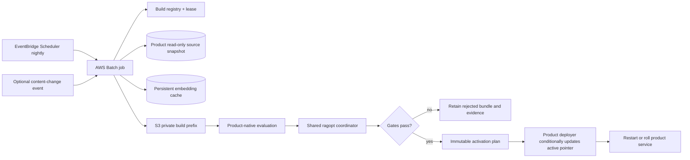

# Production Index Build Scheduling, Resumability, and RAGOPT Integration

## Executive Summary

`ragopt` should become the shared **production-refresh control plane** for the
RAG-TTC Admin Chat, the customer-facing TTC Garden Assistant, and CoinVault/GEC.
That means it owns the small reusable protocol around a build: semantic input
identity, durable run and progress records, replay/resume rules, immutable
artifact references, evaluation custody, comparison, gates, and a promotion
plan. It must not become a cron service, distributed queue, index-format
library, product extractor, chat runtime, or deployment controller.

The same coordinator should drive three adapters. RAG-TTC can build one
WordPress/WooCommerce-derived immutable knowledge bundle and validate it
through separate Garden and Admin serving/evaluation adapters. CoinVault/GEC
builds its own MySQL/curated-SQL bundle and validates it through its native
retrieval and tool runtime. The sources, index formats, queries, and activation
mechanisms remain product-owned; the lifecycle and evidence vocabulary are
shared.

The first GEC production refresh should keep the already-proven deterministic
full scan and content-addressed embedding cache. Run one coarse-grained build
container nightly. On AWS, the pragmatic default is EventBridge Scheduler →
AWS Batch → a product command that embeds the `ragopt` coordinator. RAG-TTC's
generic `flow` package remains a useful inner, replayable per-item executor,
not durable cloud orchestration. We should reuse or move it only after two
product adapters demonstrate the exact common API; copying it speculatively
would create two subtly different execution frameworks.

The practical slogan is:

```text
ragopt owns the refresh protocol and evidence.
The product owns knowledge semantics and serving.
AWS Batch or River owns durable job execution.
The deployment owner owns activation and rollback.
```

## Problem Statement

The existing GEC knowledge builder is a deterministic manual command:

```text
MySQL products/categories + curated SQL docs
    -> normalized documents
    -> optional furniture removal
    -> heading-aware chunks
    -> raw + breadcrumb representations
    -> optional cached embeddings
    -> lexical + optional vector index
    -> immutable content-addressed bundle
```

The implementation already has important product invariants:

- active products and substantive category descriptions are extracted in a
  stable order;
- prices, costs, and inventory remain live SQL facts and are not indexed;
- document and representation identities are content-addressed;
- repeated builds reuse unchanged embedding results;
- a bundle is immutable and repeated identical input reuses its directory;
- the hybrid configuration was benchmark-gated before adoption.

Production operation is missing around that core:

- no durable schedule or change trigger;
- no cross-process job ownership, heartbeat, or overlap prevention;
- no product build-state record with stage progress;
- no production artifact upload and verification contract;
- no retrieval gate wired between build and activation;
- no atomic active-bundle pointer or rollback operation;
- no server hot reload; startup selects one bundle;
- no `cms_entries` connector;
- the AWS embedding topology is undecided because the current manifest uses a
  local Ollama endpoint.

The design must survive retries and worker death without duplicate provider
spend, make partial work visible without making it serveable, and never let
`ragopt` accidentally promote a build that has not passed product validation.

## Proposed Solution

### The three consumers

The word “chatbot” hides two independent systems: the offline knowledge path
and the online conversation path. `ragopt` sits across the boundary but does
not replace either one.

```text
OFFLINE / ASYNCHRONOUS                         ONLINE / REQUEST PATH

source snapshot                               user message
      |                                             |
extract -> normalize -> chunk                       v
      |                                      product chat runtime
represent -> embed -> index                          |
      |                                      tools / query variants
immutable bundle                                     |
      |                                      fusion / rerank / SQL
verify -> evaluate -> gate                           |
      |                                             v
activation plan ----------------------------> answer + citations + UI
```

The consumers overlap heavily, but they are not interchangeable:

| Consumer | Source and bundle | Runtime under evaluation | Product-specific risk |
|---|---|---|---|
| TTC Garden Assistant | WordPress/WooCommerce customer-visible products, categories, plant descriptions, guides, and facts | customer-facing hybrid retrieval, ranked fusion, reranking, answer generation, comparison/product-card rendering | incorrect public facts, poor recommendation relevance, unusable cards, hidden/non-public data |
| RAG-TTC Admin Chat | preferably the same approved TTC bundle, plus explicitly authorized operational tools and live facts | canonical full-page conversation runtime, history, voting/comments, tool loop, authorization | access-scope leaks, stale operational facts, unsafe actions, session/tool-loop regressions |
| CoinVault/GEC | active MySQL products/categories plus curated SQL documentation; prices, costs, and stock stay live | native retrieval plus SQL/tool routing for logistics users | authorization, judge-accounting errors, confusing indexed prose with live inventory |

One shared TTC bundle is desirable when the underlying customer-visible corpus
is the same. It does **not** imply one shared evaluation. Garden and Admin have
different prompts, tools, authorization boundaries, user interfaces, and
answer contracts, so a candidate TTC bundle must pass both required product
gates before it becomes the common active bundle.

```text
                 WordPress / WooCommerce snapshot
                              |
                       TTC product builder
                              |
                    immutable TTC bundle B42
                         /             \
                        /               \
             Garden adapter         Admin adapter
             retrieval + UI         tool loop + auth
                 gate                   gate
                        \               /
                         promotion plan

      MySQL + curated SQL docs
                 |
          GEC product builder
                 |
       immutable GEC bundle G17
                 |
        CoinVault adapter + gate
                 |
          promotion plan
```

The current Admin Chat cutover uses scripted/canned conversations to prove the
session, transport, reconnect, authorization, and UI architecture. That is a
serving-runtime milestone, not a replacement for the former real retrieval
pipeline. The future live Admin adapter connects the canonical session runtime
to the product-owned retrieval/tool resolver. `ragopt` evaluates that adapter;
it does not make canned conversations into a knowledge system.

### Two loops that must not be conflated

A nightly production refresh and a self-optimization experiment use the same
custody machinery but freeze different variables.

| Property | Content refresh | Optimization experiment |
|---|---|---|
| Changed input | source snapshot/content | exactly one declared mutable asset |
| Frozen input | extraction, chunking, index, retrieval and evaluator policy | corpus snapshot, suite, evaluator, judges, safety ceiling, all other assets |
| Challenger | newly built immutable bundle | candidate snapshot/bundle |
| Typical decision | deploy fresh data if integrity and regression gates pass | human reviews whether the candidate beats incumbent |
| Automation | may auto-activate narrowly defined data-only refreshes | v1 emits a non-applying promotion plan |

Trying to represent a new corpus snapshot as a changed prompt would be false
custody. The generic refresh contract therefore references an immutable
`ArtifactRef`; the existing one-mutation `Candidate` remains the stricter
optimization contract.

### Responsibility split

| Component | Owns | Does not own |
|---|---|---|
| Product adapter | source snapshot, extraction, normalization, chunks, representations, embeddings, index assembly, bundle verification, native evaluation arm | scheduling, distributed leases, generic comparison |
| Per-item execution (`flow` or current cached embedder) | bounded workers, retry classification, budgets, content cache, replay | cron, distributed job state, deployment |
| AWS Batch or River | durable job admission, attempts, worker lifecycle, schedule integration | RAG semantics, content identity, evaluation, bundle promotion |
| `ragopt` refresh registry/coordinator | build state/events, semantic identity, artifact links, stage protocol, resume/reconcile, evaluation handoff | extracting content, doing per-item work, cloud scheduling |
| Existing `ragopt` evaluation core | snapshots, one-mutation candidates, paired evaluation custody, comparisons, gates, promotion report | indexing, chat serving, deployment mutation |
| Deployment owner | active-bundle pointer, service rollout/reload, rollback | changing evaluation evidence |

This boundary makes `ragopt` “batteries included” at the control-plane level:
an adapter author gets a closed lifecycle, local durable registry, progress
schema, evaluation/gate integration, and a reference command. They still must
write the few functions that know what a product document, index, query, and
healthy deployment mean.

### Shared API surface

The following interfaces are a design target, not implemented code. Names may
change during the two-product proof, but the separation of concerns should not.

```go
// SourceSnapshot is a stable description of product inputs. Assets are copied
// or digest-linked; CapturedAt is metadata and is not part of semantic identity.
type SourceSnapshot struct {
    ID         string
    Product    string
    CapturedAt time.Time
    Assets     []runstore.InputRef
    Dimensions map[string]string
}

type ArtifactRef struct {
    Kind      string // corpus, index-bundle, evaluation, promotion-plan
    URI       string
    SHA256    string
    SizeBytes int64
    Schema    string
}

type BuildRequest struct {
    Product       string
    Trigger       string
    Snapshot      SourceSnapshot
    ConfigAssets  []runstore.InputRef
    ExecutorImage string // immutable digest, never a floating tag
}

type BuildArtifact struct {
    BuildID string
    Bundle  ArtifactRef
    Native  []ArtifactRef
}

type ProgressSink interface {
    Append(ctx context.Context, event BuildEvent) error
    Heartbeat(ctx context.Context, stage string, completed, total int64) error
}

type ProductBuilder interface {
    Snapshot(ctx context.Context, req SnapshotRequest) (SourceSnapshot, error)
    Build(ctx context.Context, req BuildRequest, progress ProgressSink) (BuildArtifact, error)
    Verify(ctx context.Context, artifact BuildArtifact) error
}

type ProductEvaluator interface {
    Evaluate(
        ctx context.Context,
        incumbent ArtifactRef,
        challenger ArtifactRef,
        progress ProgressSink,
    ) (ArtifactRef, error)
}

type ActivationPlanner interface {
    Plan(ctx context.Context, build BuildArtifact, evaluation ArtifactRef) (ArtifactRef, error)
}
```

`ProductBuilder` is deliberately coarse. The shared coordinator must not learn
about headings, WordPress IDs, Ollama batches, SQLite vector indexes, SQL tools,
or product cards. Those details belong behind the adapter and in native
artifacts. A product can use `flow`, ragkit, direct loops, or a vendor SDK
inside `Build` as long as it obeys cancellation, progress, and artifact rules.

The reference coordinator is a fixed sequence, not a general DAG engine:

```text
Refresh(request):
    snapshot = builder.Snapshot(request)
    buildID = SemanticBuildID(snapshot, config assets, image digest)

    run = registry.AcquireOrResume(buildID)
    if run already has verified bundle:
        bundle = load and verify recorded artifact
    else:
        bundle = builder.Build(buildID, progress sink)
        builder.Verify(bundle)
        registry.RecordVerified(bundle)

    incumbent = product channel's currently active immutable bundle
    evaluation = evaluator.Evaluate(incumbent, bundle)
    decision = ragopt.CompareAndGate(evaluation, product policy)
    plan = activationPlanner.Plan(bundle, evaluation, decision)
    registry.RecordDecision(plan)  // does not deploy it
    return plan
```

The coordinator should return a typed terminal result for `reused`,
`awaiting_activation`, `rejected`, `failed`, or `canceled`. Infrastructure
retries transient execution failures. Quality-gate rejection is a successful
execution with a negative product decision, not a failed Batch/River job.

### Build events, progress, and operator visibility

The registry stores a current projection plus an append-only event stream. The
projection makes dashboards cheap; the events preserve the audit trail.

```go
type BuildEvent struct {
    Schema      string          // ragopt-build-event/v1
    BuildID     string
    Sequence    uint64
    At          time.Time
    Type        string          // requested, stage_started, progress, artifact, decision, terminal
    Stage       string
    Completed   int64
    Total       int64
    CacheHits   int64
    CacheMisses int64
    Artifact    *ArtifactRef
    Detail      json.RawMessage // product-owned, bounded, no secrets
}
```

Required operational queries are intentionally boring:

- Which product refresh is running, and which immutable inputs does it use?
- When was its last heartbeat?
- How many documents/representations are complete?
- How much expensive work was reused from cache?
- Which artifact and native evaluation run were produced?
- Was the terminal result execution failure, quality rejection, or an
  activation-ready plan?
- Which active bundle preceded it, so rollback is unambiguous?

The initial local registry can reuse the proven `pkg/runstore` append-and-sync
patterns. Production adapters implement the same registry contract with
DynamoDB/S3 or an existing Postgres database. `ragopt` should ship the schema
and conformance tests, not a home-grown distributed database.

### One stable build identity

Every trigger first resolves immutable inputs and computes a semantic build
identity:

```text
build_id = SHA256(canonical JSON {
    source_snapshot_digest,
    curated_docs_digest,
    knowledge_manifest_digest,
    extractor_version,
    chunker_identity,
    representation_identity,
    embedding_provider,
    embedding_model,
    embedding_dimensions,
    container_image_digest,
})
```

Do not include timestamps, AWS job IDs, worker counts, retry counts, or log
locations. They describe execution, not the artifact's meaning.

A nightly trigger may discover the same `build_id` as yesterday. That is a
successful no-op/reuse, not another distinct bundle. A change-triggered and
nightly trigger racing on the same ID must converge on one active build.

### Shared build-run state machine

```text
requested
   -> snapshotting
   -> extracting
   -> representing
   -> embedding
   -> assembling
   -> verifying
   -> evaluating
   -> rejected | awaiting_activation
   -> activating
   -> active

Any nonterminal stage -> failed or canceled
active -> rolled_back (if the prior bundle is restored)
```

Only `active` is served. `awaiting_activation` is complete evidence but not a
deployment claim. `failed` retains the error and partial/cache references; it
must never leave a bundle in the active namespace.

The build registry record should minimally contain the following generic
projection. Product-specific counters live in events rather than expanding
this structure for every adapter.

```go
type BuildRun struct {
    BuildID             string
    Trigger             string // nightly, source-change, manual
    State               string
    Stage               string
    SourceSnapshotID    string
    ManifestDigest      string
    ImageDigest         string
    Attempt             int
    StartedAt           time.Time
    HeartbeatAt         time.Time
    FinishedAt          *time.Time
    ItemsTotal          int64
    ItemsCompleted      int64
    CacheHits           int64
    CacheMisses         int64
    BundleID            string
    BundleURI           string
    EvaluationRunID     string
    Decision            string
    ErrorClass          string
    ErrorMessage        string
}
```

This record is operational state, not the authoritative bundle. The bundle and
ragopt run remain immutable artifacts with their own digests.

### Resume model

Resume happens at two levels:

1. **Outer job retry.** AWS Batch or River restarts the coarse build command
   with the same `build_id`. It does not attempt to resume a Go stack frame.
2. **Inner replay.** The command reconstructs deterministic documents,
   chunks, and representation identities. Existing embedding-cache entries are
   loaded, so only missing representations call the provider. A completed
   bundle ID is verified and reused.

That gives a simple failure rule:

```text
retry(build_id):
    acquire_or_renew_lease(build_id)
    recompute deterministic plan
    replay every stage
    cached expensive items become hits
    atomic bundle assembly starts from a private temporary directory
    publish manifest/bundle only after all required files verify
```

RAG-TTC `flow` formalizes this as “resume = replay”: content-addressed step
results survive, while at most one in-flight item per worker is lost on a
process crash. The current GEC builder already applies this principle to
embeddings in blocks of 1,000. The first production milestone should preserve
that code and add durable cache storage; a `flow` migration is a separate,
benchmarkable refactor.

### AWS deployment, minimal version



Use:

- EventBridge Scheduler for nightly cron, delivery retries, and an SQS DLQ;
- AWS Batch for the long-running container and infrastructure-level retries;
- CloudWatch structured logs keyed by `build_id` and stage;
- a small DynamoDB table for the generic build registry/lease if no suitable
  operational Postgres already exists;
- S3 for immutable corpora, reports, bundles, evaluation runs, and active/
  previous pointer documents;
- persistent cache storage for the existing file cache. EFS is the lowest-code
  first option; measure its small-file behavior before committing. An S3-backed
  cache/store is cleaner long-term but is product implementation work.

AWS Batch retry attempts are coarse. Retry capacity/startup/transient failures,
but exit immediately for invalid manifests, corpus contract failures, digest
mismatches, or failed quality gates. EventBridge delivery retry is distinct
from Batch job retry and should use a DLQ.

### Activation and rollback

Build under a private staging prefix and verify after upload:

```text
s3://<product-knowledge>/builds/<build_id>/...
s3://<product-knowledge>/bundles/<bundle_id>/manifest.json
s3://<product-knowledge>/channels/production.json
s3://<product-knowledge>/channels/previous.json
```

`production.json` contains the selected bundle ID, manifest digest, evaluation
run ID, gate decision digest, activation time, and previous bundle ID. Update
it conditionally against the version/ETag observed before evaluation. If the
condition fails, another activation won; do not overwrite it blindly.

CoinVault currently opens one verified local bundle at startup, and the same
startup-pinning model is an acceptable baseline for TTC services. The
pragmatic activation mechanism is therefore:

1. write the production pointer conditionally;
2. start an ECS rolling deployment or controlled restart;
3. have startup download the exact bundle to local disk and verify it;
4. mark the deployment healthy only after the product retrieval runtime opens
   the exact verified bundle;
5. roll back by restoring `previous.json` and redeploying.

Do not add hot reload to the first production refresh merely to avoid a safe
rolling restart.

### Where product adapters enter

Each product adapter constructs an immutable ragopt snapshot from:

- candidate bundle manifest and digest;
- source snapshot digest;
- extraction/chunking/representation identities;
- retrieval configuration, reranker, synonym and routing assets;
- frozen retrieval and answer suites;
- model/judge/evaluator identities;
- safety, access-scope, and SQL-tool contracts.

It then evaluates incumbent and challenger through the product's native
retrieval/chat runtime. `ragopt` writes comparison custody and a promotion
report. It does not update `production.json` or restart a service. A human or
product deployment command consumes an approved plan.

The adapters should be thin and live in the consumer repositories:

```text
rag-ttc/
  internal/ragoptadapter/ttcbuild/       shared TTC source/build adapter
  internal/ragoptadapter/garden/         Garden evaluation arm
  internal/ragoptadapter/admin/          Admin evaluation arm

2026-03-16--gec-rag/
  internal/ragoptadapter/knowledge/      GEC build and CoinVault evaluation arm
```

These paths are proposals, not current implementation. Keeping adapters near
the native runtime lets them call typed Go APIs and preserve native artifacts;
it avoids a premature subprocess/plugin protocol in `ragopt`.

For an ordinary nightly content refresh with no retrieval-policy mutation,
the “candidate” is the new source/bundle identity rather than a changed prompt.
The product gate should emphasize corpus integrity, retrieval regression,
coverage, access-scope preservation, latency, and cost. Do not force it through
the one-mutable-text candidate API if that model cannot honestly represent a
data refresh; define the product integration contract before coding it.

## Current Code Map for an Intern

Start with the data path, then read the control path. Reading the chat UI first
can make the canned Admin transport fixtures look like the knowledge system;
they are not.

### CoinVault/GEC

- `internal/knowledgebuild/connectors.go` performs the full ordered extraction
  of active products and categories and appends curated SQL documentation. It
  assigns stable IDs, records source metadata, normalizes HTML/text, and
  deliberately excludes live price, cost, and quantity facts.
- `internal/knowledgebuild/build.go` is the current orchestration core. It
  strips repeated furniture when configured, performs heading-aware chunking,
  emits raw and breadcrumb representations, calls the cached embedder, builds
  the lexical/vector index, writes the immutable bundle, and emits a report.
- `data/knowledge-manifest-hybrid.yaml` fixes the current hybrid identity:
  local Ollama, `nomic-embed-text`, 768 dimensions, batches of 16, four
  workers, and an exact SQLite vector index.
- `pkg/knowledgebundle` and the startup wiring that opens the selected bundle
  define the serving-side artifact contract. Those APIs must be referenced by
  the adapter rather than reimplemented in `ragopt`.

### RAG-TTC and Garden

- `rag-ttc/pkg/flow/doc.go` states the crucial execution contract: a typed,
  bounded, replayable pipeline, but no DAG scheduler, persisted control state,
  or distributed execution.
- `rag-ttc/pkg/flow/store.go` supplies the content-addressed store abstraction
  and file-backed cache used to make replay cheap.
- `rag-ttc/pkg/rag/indexbundle/build.go` builds through a temporary location
  and publishes by rename, the correct local model for immutable artifact
  assembly.
- `2026-05-27--ttc-design-system/backend/cmd/ttc-garden-chat` is the
  customer-facing Garden Assistant entry point.
- `2026-05-27--ttc-design-system/backend/internal/ragsearch` is the real Garden
  retrieval implementation: it is the place to understand query generation,
  lexical/vector retrieval, ranked fusion, reranking, and product facts.
- `rag-ttc/pkg/app/chatserver` is the canonical Admin conversation/session
  composition under the separate cutover ticket. Its scripted resolver is a
  transport/lifecycle fixture until a live retrieval/tool adapter is wired.
- `rag-ttc/pkg/rag/tooleval`, `pkg/rag/toolanswer`, and the existing
  `tool-loop ragopt` command are the present evaluation integration point.
  Phase 5 of RAGOPT-001 proves custody there; it does not claim that the Admin
  UI is already live-retrieval backed.

### RAGOPT

- `pkg/runstore` contains durable local run custody, atomic JSON writes,
  append-plus-`fsync` JSONL, copied input references, and terminal-state
  invariants. The refresh registry should reuse these mechanics and schemas
  where their semantics match.
- `pkg/candidate` freezes parent/candidate system identity and enforces exactly
  one mutable asset for optimization candidates.
- `pkg/eval` runs paired incumbent/challenger cells and resumes by completed
  semantic keys.
- `pkg/compare`, `pkg/gate`, and `pkg/report` convert native outcomes into a
  paired decision and non-applying promotion plan.

Before implementation, verify the exact current package names with `rg --files`
and `go doc`; this document describes the intended dependency direction, not a
license to create compatibility adapters around renamed APIs.

## Failure Semantics

Retries are safe only when errors are classified at the layer that can act on
them.

| Failure | Coordinator result | Infrastructure behavior | Artifact behavior |
|---|---|---|---|
| source snapshot temporarily unavailable | failed/transient | retry same semantic request after source becomes available | no candidate artifact |
| invalid manifest or authorization contract | failed/permanent | no automatic retry | retain diagnostic record |
| embedding/provider timeout | failed/transient | retry same build ID | reuse completed content-cache entries |
| worker/container death | stale heartbeat, then retried | queue starts another attempt | replay deterministic stages; private staging remains unservable |
| bundle digest/verification mismatch | failed/permanent | alert, no activation | quarantine incomplete/corrupt prefix |
| native evaluation tool/model outage | failed/transient, budget permitting | retry evaluation without rebuilding verified bundle | preserve failed native evidence |
| regression gate rejects challenger | rejected | job succeeds operationally | retain bundle and evaluation; do not activate |
| activation pointer compare-and-swap loses | superseded/conflict | reconcile against new incumbent | never blindly overwrite winner |
| new deployment fails health check | activation failed | product deployer rolls back | restore previous immutable pointer |

Cancellation is cooperative: every adapter accepts `context.Context`; bounded
workers stop admitting new items; completed cache entries and synced events
remain; no partial bundle enters the verified namespace. A later request with
the same identity replays safely.

## Security and Data Boundaries

The build worker requires read-only source access and write access only to its
product artifact prefixes and registry rows. The deployer has channel-pointer
and service-rollout permissions but does not need database extraction access.
The chat service has read access to the active bundle and live tools according
to its user authorization; it does not need build-prefix write access.

Never place credentials, raw customer conversations, private operational
records, or unrestricted SQL results in generic `BuildEvent.Detail`. Artifact
metadata may contain digests and URIs, but access to the object remains an IAM
decision. Admin and Garden evaluations must use explicit identities/scopes;
sharing a TTC corpus must not broaden Garden visibility to Admin-only tools or
data.

## Metrics and Service-Level Signals

At minimum emit these dimensions with `product`, `build_id`, `stage`, and
terminal classification where cardinality permits:

- build age, duration, heartbeat age, attempt count, and queue delay;
- extracted/included/excluded document counts and change from incumbent;
- chunk and representation counts;
- embedding cache hits, misses, provider calls, tokens/items, latency, and cost;
- bundle bytes, upload/verification time, and digest result;
- suite cases/cells complete, contract failures, abstentions, retrieval metrics,
  answer metrics, latency, and cost deltas;
- gate outcome, rejection reasons, active-bundle age, activation duration, and
  rollback count.

Alert on a stale heartbeat, failed terminal state, repeated gate rejection,
unexpected corpus shrinkage, active-bundle age beyond policy, queue starvation,
and failed rollout. A dashboard is an infrastructure presentation over the
shared event/projection schema, not a reason to add a web UI to `ragopt`.

## Design Decisions

### Full rebuild before incremental extraction

Keep the full deterministic scan initially. Roughly 16,000 source documents is
small enough, deletions are naturally represented, and unchanged embeddings
are already content-cache hits. `updated_at` watermarks and CDC add tombstones,
backfills, transaction-boundary semantics, and recovery complexity without yet
solving the expensive part better than the existing cache.

### One job, not 88,000 queue entries

The durable queue owns one bundle build. Do not enqueue one River/Batch job per
representation. Per-item fan-out would make budgets, global corpus identity,
atomic publication, and cancellation substantially harder. Use local bounded
workers inside the container.

### Product build registry is separate from ragopt runstore

An operational build may be retried, heartbeated, canceled, and activated.
Ragopt runs are immutable evaluation custody. Reusing the same state machine
for both would blur operational and experimental truth. Link them by digest and
run ID.

### A fixed coordinator, not a workflow framework

The RAGOPT v1 guardrail correctly excludes a scheduler, daemon, and generic
workflow engine. A fixed refresh coordinator does not violate that boundary:
it is library code for one closed sequence and one event contract. Production
job admission, leases across workers, schedules, and deployment remain
infrastructure/product concerns.

### Flow is an inner executor

`flow` is generic and useful, but its own package contract states that it has
no DAG scheduler, persisted control state, or distributed execution. It can
replace the GEC embedding loop later if it materially improves uniform retry,
budget, progress, or cache behavior. It cannot replace AWS Batch or River.

## Alternatives Considered

### River

River is attractive if the production application already operates Postgres
and an always-on Go worker service. It provides transactional enqueueing,
periodic jobs, unique jobs, retries, multiple queues, telemetry hooks, and an
inspection UI. A sensible River job would be coarse:

```go
type RefreshKnowledgeArgs struct {
    RequestedSourceSnapshot string `json:"requested_source_snapshot"`
    ManifestDigest          string `json:"manifest_digest"`
}

func (RefreshKnowledgeArgs) Kind() string { return "refresh_knowledge" }
```

Uniqueness should include the resolved source/config identity, and the worker
must remain idempotent because a crashed or falsely-stuck job can execute more
than once. River still needs durable object/cache storage and a build registry.

Do not introduce Postgres solely to obtain River if GEC is otherwise MySQL and
AWS-native. For long, bursty nightly containers, AWS Batch has fewer always-on
components. Choose River if transactional “content changed → enqueue refresh”
with an existing Postgres application is more valuable than managed batch
compute.

### Step Functions from day one

Rejected for the first milestone. A state machine becomes valuable when
extract, embed, evaluate, and activate require different images/compute,
parallel branches, or manual approval. Initially those steps share one Go
command and one artifact workspace, so Step Functions would duplicate state
without improving inner resumability.

### Build our own durable queue

Rejected. Leases, visibility timeouts, retry classification, stuck-job rescue,
cron leadership, uniqueness, cancellation, and operator tooling are mature
queue/orchestrator responsibilities. Build only the GEC-specific state and
artifact contracts.

### Change-data capture immediately

Rejected until measurement. A deterministic full scan handles deletions and
prevents missed-event drift. The embedding cache already avoids most repeated
provider work.

### Hot-reload bundles

Deferred. Immutable startup selection plus a rolling restart is easier to
verify and roll back. Hot reload adds concurrent lifetime and in-flight query
semantics that the first scheduled build does not require.

## Implementation Plan

This work begins only after the existing RAGOPT v0.1 integration proof is
complete. The phases deliberately produce reviewable vertical slices. Do not
start AWS infrastructure while the local protocol is still moving.

### Phase A — Freeze the shared refresh contract

1. Write fixture snapshots for TTC and GEC showing which assets are content,
   configuration, executor identity, evaluator identity, and live-only data.
2. Define `ragopt-build-run/v1`, `ragopt-build-event/v1`, and a generic
   `ArtifactRef`; specify canonical serialization and semantic digest inputs.
3. Define the closed state/event vocabulary and legal transitions.
4. Define `ProductBuilder`, `ProductEvaluator`, `ProgressSink`, registry, and
   activation-plan interfaces using `context.Context`.
5. Specify transient, permanent, rejected, canceled, superseded, and reused
   terminal classifications.
6. Decide whether a content refresh gets a distinct `BundleChallenger` schema
   or is represented directly by incumbent/challenger `ArtifactRef`s. Do not
   weaken the one-mutation candidate invariant.
7. Review the contract with all three product owners.

Exit criterion: TTC and GEC fixture adapters can be described without adding
product fields to the generic schemas.

### Phase B — Local batteries-included coordinator

1. Implement the event log and current projection using `runstore` atomic and
   append-sync mechanics; do not duplicate lower-level custody helpers.
2. Implement semantic build-ID calculation and validation tests showing that
   timestamps/job IDs do not affect identity while source/config/image changes
   do.
3. Implement the fixed coordinator sequence with explicit stage transitions.
4. Implement `AcquireOrResume`, heartbeats, artifact linking, and verified
   bundle reuse for one local process.
5. Add an in-memory/fixture registry for unit tests and a filesystem registry
   for local CLI use.
6. Wire verified challenger artifacts into existing paired evaluation,
   comparison, gate, report, and promotion-plan APIs.
7. Add `ragopt refresh run` and `ragopt refresh inspect` as Glazed commands with
   structured table/JSON/YAML output and `--log-level` fields.
8. Test duplicate calls, cancellation, crash after each stage, corrupt event
   tails, digest mismatch, gate rejection, and replay equivalence.

Exit criterion: a deterministic fixture build killed during expensive work can
be rerun from the same root, reuses completed work, produces one verified
artifact, and ends in the same canonical decision as an uninterrupted run.

### Phase C — CoinVault/GEC adapter and first nightly vertical slice

1. Wrap the existing extraction/build APIs; do not rewrite
   `internal/knowledgebuild` or change its corpus policy.
2. Resolve and record a consistent read-only MySQL source snapshot plus curated
   SQL and manifest digests.
3. Publish the existing content-addressed bundle as the native `ArtifactRef`.
4. Add native verification and GEC retrieval/evaluation adapter code after the
   authorization and judge-accounting P0 findings are fixed.
5. Persist the embedding cache across attempts; benchmark EFS before selecting
   it, and keep the existing cache API.
6. Run a local interrupted/resumed full build and a no-change rebuild.
7. Package one digest-pinned Batch image and a product command embedding the
   coordinator.
8. Create EventBridge nightly scheduling, Batch retry classification, SQS DLQ,
   S3 artifact prefixes, DynamoDB registry/lease, CloudWatch metrics, and
   least-privilege IAM.
9. Add conditional production/previous pointers and a controlled CoinVault
   restart, then rehearse rollback.

Exit criterion: two consecutive scheduled runs succeed; the second proves
cache reuse; a deliberately interrupted run resumes; a deliberately rejected
bundle never becomes active; rollback restores the exact prior bundle.

### Phase D — TTC shared index and Garden evaluation

1. Inventory the production WordPress/WooCommerce fields and declare the
   customer-visible allowlist, stable IDs, tombstones/full-scan semantics, and
   live-only facts.
2. Wrap the already benchmarked TTC extraction, chunking, representation,
   hybrid retrieval, ranked-fusion, and reranking configuration instead of
   inventing a second indexer.
3. Make the TTC bundle immutable and content-addressed with the same private →
   verified publication rule.
4. Implement the Garden native evaluation arm against
   `backend/internal/ragsearch`, including retrieval, answer, citation,
   comparison-card/product-card, latency, and cost contracts.
5. Run incumbent/challenger paired gates and preserve every native Garden
   artifact.
6. Exercise replay, deletion, corpus-shrinkage, and bundle rollback.

Exit criterion: a fresh TTC bundle can be built and evaluated through the real
Garden runtime twice with stable identities and canonical deltas.

### Phase E — Admin live retrieval adapter

1. Wait for the canonical Admin Chat/sessionstream cutover to stabilize; do
   not modify its transport/session ownership from this ticket.
2. Define the live Admin resolver boundary that accepts a session turn and
   invokes authorized product retrieval/tools.
3. Reuse the approved TTC bundle where its content scope matches; keep live
   price, stock, orders, and logistics facts behind authorized tools.
4. Implement the Admin native evaluation arm with conversation history,
   tool-loop, authorization, abstention, citation, latency, and cost outcomes.
5. Add Admin gates to the TTC activation policy. A shared bundle activates only
   when every mandatory serving runtime passes.
6. Prove that Garden has no access to Admin-only tools/data and that Admin
   session/history features do not alter retrieval custody.

Exit criterion: the canonical Admin chat answers fixture and benchmark queries
through real retrieval/tools, and the same TTC bundle has separate passing
Garden and Admin evidence.

### Phase F — Change triggers and operational hardening

1. Add missing approved sources such as GEC `cms_entries` before claiming a
   complete refresh.
2. Emit/coalesce a “knowledge dirty” event only after source transactions
   commit; route it to the same reconciliation command as nightly refresh.
3. Retain nightly full scans as drift repair and deletion reconciliation.
4. Add retention rules that protect active, previous, in-review, and rejected
   evidence required by policy.
5. Run chaos drills for worker death, stale lease, provider outage, corrupt
   upload, concurrent activation, and failed deployment health checks.
6. Measure full-scan and cache performance before considering watermarks, CDC,
   Step Functions, distributed per-item work, or hot reload.

Exit criterion: operators can answer what is running, resume it, explain every
decision, activate safely, and roll back without reading raw logs or editing a
database by hand.

### River decision point

River is an alternative implementation of durable admission, retries, and
scheduling—not a second refresh protocol. Choose it for a deployment only if
that product already has operational Postgres and an always-on Go worker.
Implement one coarse `RefreshKnowledge` job that calls the same coordinator.
Do not create per-document queue jobs, and do not add Postgres solely for
River. AWS Batch remains the default for long, bursty, nightly AWS workloads.

## Open Questions

- Where will `nomic-embed-text` run in AWS: a Batch sidecar, a dedicated
  internal Ollama service, EC2 GPU capacity, or a different provider? Changing
  provider/model/dimensions creates a different bundle and requires evaluation.
- Is there already an operational Postgres suitable for River, or is GEC's
  production control plane MySQL/AWS-native?
- Is EFS acceptable for the current many-file embedding cache, or should GEC
  implement an S3/SQLite-backed cache after measuring it?
- Which gates are mandatory for Garden, Admin, and CoinVault, and may a
  data-only refresh activate automatically only when every applicable gate
  passes?
- Is a nightly rolling restart acceptable, and what is the maximum tolerated
  bundle age?
- Which source transaction/snapshot mechanism provides a consistent full scan
  without overloading production MySQL?
- Should content refresh use a small `BundleChallenger` schema or direct
  incumbent/challenger `ArtifactRef`s? It must not weaken the optimization
  candidate's one-mutation contract.
- Which WordPress/WooCommerce fields are approved for the shared TTC bundle,
  and which Admin operational facts must remain live-tool-only?
- Does one TTC bundle require both Garden and Admin gates immediately, or can
  channel policy declare which serving runtimes are currently mandatory?
- Where should a shared inner per-item executor live if two adapters prove a
  need beyond their current implementations: `ragopt`, `ragkit`, or a smaller
  execution package? Decide from concrete dependency pressure, not symmetry.

## References

- [GEC extraction connectors](/home/manuel/code/gec/2026-03-16--gec-rag/internal/knowledgebuild/connectors.go)
- [GEC knowledge build](/home/manuel/code/gec/2026-03-16--gec-rag/internal/knowledgebuild/build.go)
- [GEC hybrid manifest](/home/manuel/code/gec/2026-03-16--gec-rag/data/knowledge-manifest-hybrid.yaml)
- [RAG-TTC flow package contract](/home/manuel/workspaces/2026-06-30/benchmark-cpu-inference/rag-ttc/pkg/flow/doc.go)
- [RAG-TTC flow store](/home/manuel/workspaces/2026-06-30/benchmark-cpu-inference/rag-ttc/pkg/flow/store.go)
- [RAG-TTC immutable index-bundle builder](/home/manuel/workspaces/2026-06-30/benchmark-cpu-inference/rag-ttc/pkg/rag/indexbundle/build.go)
- [RAG-TTC tool evaluation](/home/manuel/workspaces/2026-06-30/benchmark-cpu-inference/rag-ttc/pkg/rag/tooleval/runner.go)
- [RAG-TTC Admin runtime boundary](/home/manuel/workspaces/2026-06-30/benchmark-cpu-inference/rag-ttc/pkg/app/chatserver/runtime.go)
- [RAG-TTC scripted Admin fixture](/home/manuel/workspaces/2026-06-30/benchmark-cpu-inference/rag-ttc/pkg/app/chatserver/scripted_runtime.go)
- [Garden Assistant entry point](/home/manuel/workspaces/2026-06-30/benchmark-cpu-inference/2026-05-27--ttc-design-system/backend/cmd/ttc-garden-chat/main.go)
- [Garden retrieval runtime](/home/manuel/workspaces/2026-06-30/benchmark-cpu-inference/2026-05-27--ttc-design-system/backend/internal/ragsearch/ragsearch.go)
- [RAGOPT runstore](/home/manuel/code/wesen/go-go-golems/ragopt/pkg/runstore/run.go)
- [RAGOPT candidate contract](/home/manuel/code/wesen/go-go-golems/ragopt/pkg/candidate/types.go)
- [RAGOPT paired runner](/home/manuel/code/wesen/go-go-golems/ragopt/pkg/eval/runner.go)
- [RAGOPT gate evaluation](/home/manuel/code/wesen/go-go-golems/ragopt/pkg/gate/evaluate.go)
- [AWS scheduled Batch jobs](https://docs.aws.amazon.com/batch/latest/userguide/scheduled-batch-job.html)
- [AWS Batch automated retries](https://docs.aws.amazon.com/batch/latest/userguide/job_retries.html)
- [EventBridge Scheduler retry and DLQ](https://docs.aws.amazon.com/scheduler/latest/UserGuide/managing-schedule.html)
- [River](https://github.com/riverqueue/river)
